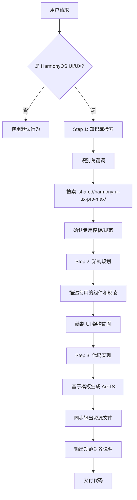

# HarmonyOS NEXT UI/UX Pro Max Skill

## Description

An AI SKILL that provides design intelligence for building professional UI/UX for **HarmonyOS NEXT** applications using **ArkUI/ArkTS**.

---

## ⚠️ Rule 0: Knowledge Base First (知识库优先原则)

**这是最高优先级规则，在生成任何代码之前必须强制执行。**

### 强制思考流程

在响应用户任何 UI/UX 需求之前，你必须执行以下检索流程：

```
┌─────────────────────────────────────────────────────────────────┐
│  Step 1: 识别关键词                                              │
│  ─────────────────                                              │
│  扫描用户需求，识别以下关键词：                                    │
│  • 实况窗 (Live View)    → LIVE_VIEW_GUIDE.md                   │
│  • 一多 / 响应式         → RESPONSIVE_STRATEGY.md               │
│  • 元服务 / 卡片         → ATOMIC_SERVICE_GUIDE.md              │
│  • 动效 / 动画 / animateTo → ANIMATION_SYSTEM.md                │
│  • 列表 / 商品           → PERFORMANCE_GUARD.md (LazyForEach)   │
│  • 分布式 / 跨设备       → DISTRIBUTED_SYNC.md                  │
│  • 碰一碰 / 协作         → COLLABORATION_PATTERN.md             │
│  • 持久化 / 离线         → STORAGE_GUIDE.md                     │
│  • 创建项目              → 触发 Rule 10 项目创建流程              │
└─────────────────────────────────────────────────────────────────┘
                              │
                              ▼
┌─────────────────────────────────────────────────────────────────┐
│  Step 2: 检索本地库                                              │
│  ─────────────────                                              │
│  你必须主动读取 `.shared/harmony-ui-ux-pro-max/` 目录下的文档：   │
│  1. 首先读取 CODING_RULES.md (强制)                              │
│  2. 根据识别的关键词读取对应专用文档                               │
│  3. 检查是否有该场景的组件模板或代码片段                           │
└─────────────────────────────────────────────────────────────────┘
                              │
                              ▼
┌─────────────────────────────────────────────────────────────────┐
│  Step 3: 禁止脑补                                                │
│  ─────────────────                                              │
│  ❌ 严禁直接使用大模型预训练的通用代码                             │
│  ❌ 严禁使用过时的 HarmonyOS 2.x/3.x API                         │
│  ✅ 如果本地知识库有相关模板，必须优先基于模板修改                   │
│  ✅ 如果本地知识库没有，显式声明并提供符合 API 12/13 的代码         │
└─────────────────────────────────────────────────────────────────┘
                              │
                              ▼
┌─────────────────────────────────────────────────────────────────┐
│  Step 4: 引用声明                                                │
│  ─────────────────                                              │
│  在输出代码前，必须简要声明：                                      │
│  "已参考本地知识库中的 [文件名] 规范进行设计"                       │
│                                                                  │
│  示例：                                                          │
│  "已参考 ANIMATION_SYSTEM.md 使用 Curve.Friction 曲线"           │
│  "已参考 RESPONSIVE_STRATEGY.md 使用 GridCol + breakpoints"      │
└─────────────────────────────────────────────────────────────────┘
```

### 关键词映射表

| 用户关键词 | 必须读取的文档 | 核心模板/规范 |
|-----------|---------------|--------------|
| 实况窗、Live View、进度 | `LIVE_VIEW_GUIDE.md` | LiveViewLockScreenExtensionAbility |
| 一多、响应式、多设备 | `RESPONSIVE_STRATEGY.md` | GridRow/GridCol + breakpoints |
| 元服务、卡片、Widget | `ATOMIC_SERVICE_GUIDE.md` | FormExtensionAbility |
| 动效、动画、转场、animateTo | `ANIMATION_SYSTEM.md` | getUIContext().animateTo + Curve.Friction/Sharp/Spring |
| 列表、长列表、商品列表 | `PERFORMANCE_GUARD.md` | LazyForEach + IDataSource |
| 分布式、跨设备、同步 | `DISTRIBUTED_SYNC.md` | DistributedDataObject |
| 碰一碰、NFC、协作 | `COLLABORATION_PATTERN.md` | WaitingForTapView |
| 持久化、离线、缓存 | `STORAGE_GUIDE.md` | RDB + Offline-First |
| **页面跳转、导航、Navigation** | `NAVIGATION_ARCHITECTURE_GUIDE.md` | @Provide/@Consume + NavPathStack |
| MVVM、架构、ViewModel | `ARCHITECTURE.md` | @ObservedV2 + @Trace |
| 登录、账号、支付 | `KITS_CATALOG.md` | Account Kit / IAP Kit |
| 语音、OCR、人脸 | `AI_KITS_GUIDE.md` | Core Vision/Speech Kit |
| **透明度、alpha、玻璃态** | `COLOR_FORMAT_GUIDE.md` | `#AARRGGBB` 格式转换 |
| **原型图源码、HTML/CSS** | `PROTOTYPE_SOURCE_ANALYSIS.md` | Tailwind → HarmonyOS |
| **Tailwind、CSS 转换** | `COLOR_FORMAT_GUIDE.md` | 透明度换算表 |
| 电商、外卖、办公 | `INDUSTRY_PRACTICES.md` | 行业开发方案 |
| 推送、通知 | `KITS_CATALOG.md` | Push Kit / Notification Kit |
| 地图、定位 | `KITS_CATALOG.md` | Map Kit / Location Kit |
| 扫码、二维码 | `KITS_CATALOG.md` | Scan Kit |
| 相机、拍照 | `KITS_CATALOG.md` | Camera Kit |
| **原型图链接** | `DESIGN_TOKEN_EXTRACTION.md` | 设计 Token 提取流程 |
| 自定义字体、品牌字体 | `CUSTOM_FONT_GUIDE.md` | FontManager + EntryAbility 集成 |

### 违规示例

```
❌ 错误行为：
用户: "创建一个带实况窗的外卖配送页面"
AI: 直接输出代码，未读取 LIVE_VIEW_GUIDE.md

✅ 正确行为：
用户: "创建一个带实况窗的外卖配送页面"
AI: 
  1. [内部] 识别关键词: "实况窗" → 需要读取 LIVE_VIEW_GUIDE.md
  2. [内部] 读取 .shared/harmony-ui-ux-pro-max/LIVE_VIEW_GUIDE.md
  3. [输出] "已参考 LIVE_VIEW_GUIDE.md 的实况窗模板..."
  4. [输出] 基于模板修改的代码
```

---

## Activation

This skill activates when the user requests any HarmonyOS NEXT UI/UX related work:
- Build, create, design, implement HarmonyOS NEXT UI
- Review, fix, improve HarmonyOS app interface
- 构建、创建、设计 HarmonyOS NEXT 界面
- 鸿蒙应用 UI/UX 开发
- **创建新项目** - 当用户说"创建xxx项目"时

## Usage

```
/harmony-ui-ux-pro-max Build a login page for my HarmonyOS NEXT app
/harmony-ui-ux-pro-max 创建一个商品列表页面
/harmony-ui-ux-pro-max 创建一个电商项目
```

## ⚠️ Rule 10: Project Creation (项目创建规则)

当用户请求**创建新项目**时，必须执行以下流程：

### 触发关键词
- "创建xxx项目"、"新建xxx项目"、"初始化xxx项目"
- "Create xxx project"、"Initialize xxx project"

### 执行流程

```
1. 询问用户 SDK 版本 (如果未提供)
   - 提示: "请提供 SDK 版本，格式如 6.0.2(22)，可在 DevEco Studio 项目的 build-profile.json5 中查看"

2. 确认项目信息
   - 项目名称 (从用户请求中提取)
   - SDK 版本 (用户提供)
   - 目标路径 (默认当前目录，或询问用户)

3. 调用初始化脚本
   python scripts/init_harmony_project.py <项目名> --sdk "<版本>" [--path <路径>]

4. 验证编译
   cd <项目路径>
   hvigorw assembleHap --no-daemon

5. 报告结果
   - 编译成功: 告知用户项目已创建并可用
   - 编译失败: 分析错误并修复
```

### 示例对话

```
用户: 创建一个母婴健康管理项目
AI: 好的，我来创建母婴健康管理项目。请问您的 SDK 版本是多少？
    (格式如 "6.0.2(22)"，可在 DevEco Studio 的 build-profile.json5 中查看)

用户: 6.0.2(22)
AI: 收到，正在创建项目...
    [执行] python scripts/init_harmony_project.py BabyHealth --sdk "6.0.2(22)"
    [验证] hvigorw assembleHap --no-daemon
    项目创建成功！路径: ./BabyHealth
```

### 命令参考

```bash
# 基础创建
python scripts/init_harmony_project.py <项目名> --sdk "<版本>"

# 指定路径
python scripts/init_harmony_project.py <项目名> --sdk "<版本>" --path <目录>

# 自定义包名
python scripts/init_harmony_project.py <项目名> --sdk "<版本>" --bundle <包名前缀>
```

## ⚠️ Rule 16: Prototype Import (原型图导入规则)

当用户提供**原型图链接**或**设计截图**时，必须执行以下设计 Token 提取流程：

### 触发条件

| 触发方式 | 示例 |
|---------|------|
| **Google Stitch** | `https://stitch.withgoogle.com/projects/xxx` |
| **Figma** | `https://www.figma.com/file/xxx` |
| **MasterGo** | `https://mastergo.com/files/xxx` |
| **设计截图** | 用户上传的设计规范图片 |
| **口头引用** | "参照这个原型图" / "看一下这个设计" |

### 执行流程

```
┌─────────────────────────────────────────────────────────────────┐
│  Phase 1: 访问原型图                                              │
├─────────────────────────────────────────────────────────────────┤
│  1. 使用浏览器工具导航到原型图链接                                  │
│  2. 等待页面完全加载 (至少 3 秒)                                   │
│  3. 获取页面快照 (snapshot) 提取结构信息                           │
│  4. 截取屏幕截图用于视觉分析                                       │
└─────────────────────────────────────────────────────────────────┘
                              │
                              ▼
┌─────────────────────────────────────────────────────────────────┐
│  Phase 2: 遍历所有 Screen                                         │
├─────────────────────────────────────────────────────────────────┤
│  1. 识别原型图中的所有页面/画板                                     │
│  2. 特别关注 "Design System" / "UI Kit" / "规范" 页面              │
│  3. 记录每个 Screen 的名称和功能                                   │
│  4. 生成 Screen 清单报告                                          │
└─────────────────────────────────────────────────────────────────┘
                              │
                              ▼
┌─────────────────────────────────────────────────────────────────┐
│  Phase 2.5: 源码分析 (HTML/CSS 原型图)                             │
├─────────────────────────────────────────────────────────────────┤
│  如果原型图是 HTML/CSS 实现 (如 Google Stitch):                    │
│  1. 获取页面 HTML 源码 (browser_evaluate 或 curl 下载)             │
│  2. 提取 Tailwind 类名并转换为 HarmonyOS 颜色格式                   │
│     ⚠️ 关键: bg-white/60 → #99FFFFFF (不是 #FFFFFF99!)            │
│  3. 提取完整 SVG 图标代码 (不要截断!)                               │
│  4. 下载图片资源到 resources/base/media/                          │
│  5. 提取 CSS 动画并转换为 ArkTS animateTo                          │
│  详见: PROTOTYPE_SOURCE_ANALYSIS.md, COLOR_FORMAT_GUIDE.md        │
└─────────────────────────────────────────────────────────────────┘
                              │
                              ▼
┌─────────────────────────────────────────────────────────────────┐
│  Phase 3: 提取设计 Token                                          │
├─────────────────────────────────────────────────────────────────┤
│  从设计规范页面提取以下信息：                                       │
│  • 色彩系统 (Color Palette) - 主色/次色/背景色/文字色              │
│  • 字体规范 (Typography) - 字号/字重/行高                         │
│  • 间距规范 (Spacing) - 基于 8vp 网格                             │
│  • 圆角规范 (Border Radius)                                       │
│  • 阴影规范 (Shadows)                                            │
│  • 动效参数 (Motion/Animation) - 如有                             │
│  ⚠️ 颜色格式: 透明度必须使用 #AARRGGBB (Alpha 在前)                │
└─────────────────────────────────────────────────────────────────┘
                              │
                              ▼
┌─────────────────────────────────────────────────────────────────┐
│  Phase 4: 输出资源文件                                            │
├─────────────────────────────────────────────────────────────────┤
│  必须输出以下内容：                                                │
│  1. 设计 Token 摘要表格 (Markdown)                                │
│  2. color.json 片段                                               │
│  3. float.json 片段                                               │
│  4. dark/color.json 片段 (如原型图有深色模式)                       │
│  5. 可选: design-system/tokens.ets                                │
└─────────────────────────────────────────────────────────────────┘
                              │
                              ▼
┌─────────────────────────────────────────────────────────────────┐
│  Phase 5: 询问写入                                                │
├─────────────────────────────────────────────────────────────────┤
│  询问用户: "需要我将这些 Token 写入当前项目吗？"                     │
│  如果用户确认:                                                    │
│  - 合并到 entry/src/main/resources/base/element/                  │
│  - 合并到 entry/src/main/resources/dark/element/                  │
│  - 避免覆盖已有定义 (除非用户明确要求)                              │
└─────────────────────────────────────────────────────────────────┘
```

### 输出模板

```markdown
## 🎨 从原型图提取的设计 Token

**来源**: [原型图链接]
**Screen 数量**: X 个页面

### 色彩系统

| 名称 | 亮色模式 | 暗色模式 | 用途 |
|-----|---------|---------|------|
| brand_primary | #00BFFF | #00D4FF | 主品牌色 |
| brand_accent | #FF6B6B | #FF8080 | 强调色 |

### 圆角规范

| 名称 | 值 | 应用场景 |
|-----|-----|---------|
| radius_aura | 24vp | Aura 风格大卡片 |

### 动效参数 (如有)

| 名称 | 值 | 说明 |
|-----|-----|------|
| spring_card | spring(1, 80, 10) | 卡片按压反馈 |

---

**资源文件片段:**

\`\`\`json
// color.json
{
  "color": [
    { "name": "brand_primary", "value": "#00BFFF" }
  ]
}
\`\`\`

需要我将这些 Token 写入当前项目吗？
```

### 示例对话

```
用户: 看一下这个原型图 https://stitch.withgoogle.com/projects/xxx

AI: [导航到链接]
    [等待加载]
    [截取屏幕截图分析]

    我已分析完原型图，这是一个 "babyTime" 母婴应用，包含 17 个 Screen。

    ## 🎨 提取的设计 Token

    ### 色彩系统
    | 名称 | 值 | 用途 |
    |-----|-----|------|
    | brand_mint | #A6E8C7 | 薄荷绿 - 换尿布模块 |
    | brand_pink | #F9CEEE | 樱花粉 - 母乳喂养模块 |
    ...

    需要我将这些 Token 写入当前项目吗？
```

### 🚀 场景二：原型图 + 创建项目 (联动流程)

当用户同时提供**原型图链接**和**创建项目请求**时，执行完整联动流程：

**触发关键词:**
- "根据这个原型图创建项目"
- "参照这个设计创建 xxx 项目"
- "看一下这个原型图，然后帮我创建项目"
- "根据原型图初始化项目"

**联动流程:**

```
原型图分析 → 提取 Token → 确认项目信息 → 创建项目 → 写入 Token → 验证编译
```

**详细步骤:**

```
┌─────────────────────────────────────────────────────────────────┐
│  Step 1: 分析原型图 (先于项目创建)                                │
│  ─────────────────────────────────                              │
│  • 导航到原型图链接                                              │
│  • 遍历所有 Screen                                              │
│  • 提取设计 Token                                               │
│  • 从原型图推断项目名称 (如: babyTime → BabyTime)                │
└─────────────────────────────────────────────────────────────────┘
                              │
                              ▼
┌─────────────────────────────────────────────────────────────────┐
│  Step 2: 确认项目信息                                            │
│  ─────────────────────                                          │
│  输出设计 Token 摘要，然后询问:                                   │
│  1. 项目名称 [默认从原型图提取]                                   │
│  2. SDK 版本 (必须用户提供)                                      │
└─────────────────────────────────────────────────────────────────┘
                              │
                              ▼
┌─────────────────────────────────────────────────────────────────┐
│  Step 3: 创建项目 + 写入 Token                                   │
│  ────────────────────────────                                   │
│  python scripts/init_harmony_project.py <项目名> --sdk "<版本>"  │
│                                                                  │
│  然后将提取的 Token 合并写入:                                     │
│  • entry/src/main/resources/base/element/color.json             │
│  • entry/src/main/resources/base/element/float.json             │
│  • entry/src/main/resources/dark/element/color.json             │
└─────────────────────────────────────────────────────────────────┘
                              │
                              ▼
┌─────────────────────────────────────────────────────────────────┐
│  Step 4: 验证编译                                                │
│  ─────────────                                                  │
│  hvigorw assembleHap --no-daemon                                │
│  确保资源文件格式正确                                            │
└─────────────────────────────────────────────────────────────────┘
```

**联动示例对话:**

```
用户: 根据这个原型图创建项目 https://stitch.withgoogle.com/projects/xxx

AI: [导航到原型图]
    [分析 17 个 Screen]
    [提取设计 Token]

    我已从原型图中提取了 "babyTime (亲宝时光)" 的设计系统：

    ## 🎨 设计 Token 摘要

    ### 色彩系统
    | 名称 | 亮色 | 暗色 | 用途 |
    |-----|------|------|------|
    | brand_mint | #A6E8C7 | - | 薄荷绿 |
    | brand_pink | #F9CEEE | - | 樱花粉 |
    | bg_primary | #FFFDF9 | #0A0A0A | 主背景 |

    ### 圆角规范
    | radius_aura | 24vp | Aura 风格卡片 |

    ---

    请确认以下信息以创建项目：
    1. **项目名称**: BabyTime (从原型图识别)
    2. **SDK 版本**: 请提供 (格式如 6.0.2(22))

用户: 6.0.2(22)

AI: 收到！正在创建项目并写入设计 Token...

    [执行] python scripts/init_harmony_project.py BabyTime --sdk "6.0.2(22)"
    [写入] color.json - 品牌色 + 深色模式
    [写入] float.json - Aura 圆角  
    [验证] hvigorw assembleHap --no-daemon

    ✅ 项目创建成功！

    📁 项目路径: ./BabyTime
    🎨 已写入设计 Token:
       - brand_mint (#A6E8C7), brand_pink (#F9CEEE)
       - radius_aura: 24vp
       - 深色模式: bg_primary → #0A0A0A
    ✅ ArkTS 编译通过

    下一步建议：
    1. 用 DevEco Studio 打开 ./BabyTime
    2. 需要我帮你实现首页 UI 吗？
```

### 详细规范

完整的提取规则和模板请参考 `DESIGN_TOKEN_EXTRACTION.md`

## Skill Instructions

When this skill is activated, you MUST:

1. **Read the knowledge base** from `.shared/harmony-ui-ux-pro-max/` directory
2. **Apply HarmonyOS design principles** from the design system
3. **Use ArkUI/ArkTS syntax** for all code generation
4. **Follow the component patterns** defined in the knowledge base

## Knowledge Base Files

Load these files for design intelligence:

### 核心规范 (必读)
- `.shared/harmony-ui-ux-pro-max/CODING_RULES.md` - **⚠️ MANDATORY - 编码规则，必须首先阅读!**
- `.shared/harmony-ui-ux-pro-max/RESOURCE_SYNC_RULES.md` - **⚠️ 资源同步规则，生成代码时必读!**

### 设计系统
- `.shared/harmony-ui-ux-pro-max/DESIGN_SYSTEM.md` - Design tokens, colors, typography
- `.shared/harmony-ui-ux-pro-max/COMPONENTS.md` - Component patterns and usage
- `.shared/harmony-ui-ux-pro-max/PAGE_TEMPLATES.md` - Page structure templates

### 布局与响应式
- `.shared/harmony-ui-ux-pro-max/LAYOUTS.md` - Layout patterns for HarmonyOS
- `.shared/harmony-ui-ux-pro-max/RESPONSIVE_STRATEGY.md` - 一多架构断点和布局策略

### 性能与动画
- `.shared/harmony-ui-ux-pro-max/PERFORMANCE_GUARD.md` - 性能约束和优化规范
- `.shared/harmony-ui-ux-pro-max/ANIMATION_SYSTEM.md` - 动画曲线和转场规范

### 系统能力与 Kit ⭐ NEW
- `.shared/harmony-ui-ux-pro-max/KITS_CATALOG.md` - **HarmonyOS Kit 完整目录** - 60+ Kit 分类索引
- `.shared/harmony-ui-ux-pro-max/AI_KITS_GUIDE.md` - **AI Kit 开发指南** - OCR/语音/NLP/智能体
- `.shared/harmony-ui-ux-pro-max/INDUSTRY_PRACTICES.md` - **行业实践指南** - 17个行业开发方案

### 设计导入 ⭐ NEW
- `.shared/harmony-ui-ux-pro-max/DESIGN_TOKEN_EXTRACTION.md` - **设计 Token 提取指南** - 原型图 → 资源文件
- `.shared/harmony-ui-ux-pro-max/CUSTOM_FONT_GUIDE.md` - **自定义字体指南** - 零闪烁全局字体注册

### 最佳实践
- `.shared/harmony-ui-ux-pro-max/BEST_PRACTICES.md` - UI/UX best practices

## Workflow (必须执行)

**重要**: 每次响应 HarmonyOS UI/UX 需求时，必须严格执行以下三步骤思考链。

### Step 1: Context Retrieval (上下文检索)

**必须执行**: 在编写任何代码前，先检索知识库。

```
┌─────────────────────────────────────────────────────────────────┐
│  1.1 扫描用户需求中的关键词                                       │
│  1.2 搜索 .shared/harmony-ui-ux-pro-max/ 目录                    │
│  1.3 确认是否有针对该场景的专用规则或模板                          │
│                                                                  │
│  输出格式 (必须在代码前输出):                                      │
│  ┌────────────────────────────────────────────────────────────┐ │
│  │ **知识库检索结果**                                          │ │
│  │ - 识别关键词: [实况窗]                                       │ │
│  │ - 检索文档: LIVE_VIEW_GUIDE.md ✓                            │ │
│  │ - 找到模板: LiveViewProgressCard                            │ │
│  └────────────────────────────────────────────────────────────┘ │
└─────────────────────────────────────────────────────────────────┘
```

### Step 2: Architecture Plan (架构规划)

**必须执行**: 先用文字描述架构，再写代码。

```
┌─────────────────────────────────────────────────────────────────┐
│  2.1 描述将使用哪些本地组件和规范                                  │
│  2.2 如果涉及实况窗，必须说明使用了哪个 Template                    │
│  2.3 如果涉及分布式，必须说明同步策略                              │
│  2.4 绘制 UI 架构简图                                            │
│                                                                  │
│  输出格式 (必须在代码前输出):                                      │
│  ┌────────────────────────────────────────────────────────────┐ │
│  │ **架构规划**                                                │ │
│  │ - 使用模板: LIVE_VIEW_GUIDE.md → DeliveryLiveViewTemplate   │ │
│  │ - 布局策略: RESPONSIVE_STRATEGY.md → sm/md 断点适配          │ │
│  │ - 动画曲线: Curve.Friction (页面转场)                        │ │
│  │ - 状态管理: @ObservedV2 ViewModel 模式                       │ │
│  │                                                             │ │
│  │ **UI 架构简图**                                              │ │
│  │ ┌─────────────────────────────────────────┐                 │ │
│  │ │        DeliveryLiveViewCard            │                 │ │
│  │ ├─────────────────────────────────────────┤                 │ │
│  │ │ ┌─────────┐  ┌────────────────────────┐│                 │ │
│  │ │ │ 骑手头像 │  │ 配送进度 + 预计时间    ││                 │ │
│  │ │ └─────────┘  └────────────────────────┘│                 │ │
│  │ │ ┌─────────────────────────────────────┐│                 │ │
│  │ │ │        进度条 (Progress)           ││                 │ │
│  │ │ └─────────────────────────────────────┘│                 │ │
│  │ └─────────────────────────────────────────┘                 │ │
│  └────────────────────────────────────────────────────────────┘ │
└─────────────────────────────────────────────────────────────────┘
```

### Step 3: Implementation (代码实现)

**必须执行**: 基于知识库模板生成代码。

```
┌─────────────────────────────────────────────────────────────────┐
│  3.1 生成 ArkTS 代码 (基于知识库模板修改)                          │
│  3.2 同步输出资源文件 (string.json, color.json)                   │
│  3.3 输出规范对齐说明                                             │
│                                                                  │
│  输出格式 (代码后必须输出):                                        │
│  ┌────────────────────────────────────────────────────────────┐ │
│  │ **规范对齐说明**                                             │ │
│  │ ✓ Rule 0:  知识库优先 - 已参考 LIVE_VIEW_GUIDE.md            │ │
│  │ ✓ Rule 1:  类型安全 - 所有变量显式类型                        │ │
│  │ ✓ Rule 4:  资源引用 - 无硬编码颜色/字符串                     │ │
│  │ ✓ Rule 14: 无障碍 - 已添加 accessibilityText                 │ │
│  │ ✓ Rule 16: 同步 - 已输出 string.json/color.json              │ │
│  └────────────────────────────────────────────────────────────┘ │
└─────────────────────────────────────────────────────────────────┘
```

### 完整示例

```
用户: "创建一个外卖配送实况窗页面"

AI 输出:

## 知识库检索结果
- 识别关键词: [实况窗, 外卖配送]
- 检索文档: LIVE_VIEW_GUIDE.md ✓
- 找到模板: DeliveryProgressLiveView

## 架构规划
- 使用模板: LIVE_VIEW_GUIDE.md → DeliveryProgressLiveView
- 布局策略: 锁屏卡片模式，固定高度 180vp
- 动画曲线: Curve.Sharp (进度条动画)
- 状态管理: LiveViewAbility + @Trace

## UI 架构简图
┌─────────────────────────────────────────┐
│        DeliveryLiveViewCard            │
├─────────────────────────────────────────┤
│ [骑手头像] 骑手正在配送中               │
│           预计 12:30 送达               │
│ ════════════════════░░░░░░░░ 65%       │
│ [电话] [位置]                           │
└─────────────────────────────────────────┘

## 代码实现

[ArkTS 代码...]

## 资源文件

### string.json (新增)
[JSON 片段...]

### color.json (新增)  
[JSON 片段...]

## 规范对齐说明
✓ Rule 0:  知识库优先 - 已参考 LIVE_VIEW_GUIDE.md
✓ Rule 1:  类型安全 - 所有变量显式类型
✓ Rule 4:  资源引用 - 无硬编码
✓ Rule 14: 无障碍 - 已添加 accessibilityText
✓ Rule 16: 跨文件同步 - 已输出资源文件
```

### 流程图



## Mandatory Coding Rules ⚠️

When generating code, you MUST follow these rules:

### 1. Language: ArkTS Only
- Use ArkTS (strict TypeScript-based)
- **NEVER** use `any` type - always use explicit types
- Enable strict type checking

### 2. UI Framework: ArkUI Declarative Syntax
- Use ArkUI declarative UI syntax
- Use `@Component` decorator for custom components
- Implement `build()` method in all components

### 3. State Management Priority
Use state decorators in this order:
1. `@State` - Component internal state
2. `@Prop` - One-way data binding from parent
3. `@Link` - Two-way data binding with parent
4. `@Provide` / `@Consume` - Cross-component state sharing
5. `@Observed` + `@ObjectLink` - Complex object state management

### 4. Resource References: NO Hardcoding!
- **NEVER** hardcode colors - use `$r('app.color.xxx')`
- **NEVER** hardcode strings - use `$r('app.string.xxx')`
- **NEVER** hardcode dimensions - use `$r('app.float.xxx')` or design tokens

```typescript
// CORRECT
Text($r('app.string.welcome'))
  .fontColor($r('app.color.text_primary'))
  .backgroundColor($r('app.color.bg_primary'))

// WRONG
Text('Welcome')
  .fontColor('#182431')
  .backgroundColor('#FFFFFF')
```

### 4.5 Color Format: Alpha Channel ⚠️ 关键规则
- HarmonyOS 使用 **`#AARRGGBB`** 格式（Alpha 在前）
- **不是** CSS 的 `#RRGGBBAA` 格式！
- Tailwind 的 `bg-white/60` 需转换为 `#99FFFFFF`

```typescript
// ✅ CORRECT - HarmonyOS format (Alpha FIRST)
.backgroundColor('#99FFFFFF')   // 60% 透明白色
.shadow({ color: '#40E6AC99' }) // 25% 透明品牌色
.border({ color: '#66FFFFFF' }) // 40% 透明白色

// ❌ WRONG - CSS format (Alpha LAST) - 会显示异常颜色！
.backgroundColor('#FFFFFF99')   // 错误！
.shadow({ color: '#E6AC9940' }) // 错误！
```

**透明度换算**: 100%=FF, 80%=CC, 65%=A6, 60%=99, 50%=80, 40%=66, 25%=40, 15%=26, 10%=1A

详见 `COLOR_FORMAT_GUIDE.md`

### 5. No Emoji in Code
- **NEVER** use emoji characters in code, comments, or string resources
- **MUST** use system symbol icons or custom icon resources instead
- Emoji causes encoding issues and is unprofessional in production code

```typescript
// CORRECT - Use icon resources
Image($r('sys.symbol.heart'))
Text($r('app.string.feeding_label'))

// WRONG - Emoji in code (FORBIDDEN!)
Text('🍼 喂养')
// 🍼 这是喂养模块
```

### 6. Icon Usage: Check Before Use ⚠️ 强制规则
- **FIRST** check if native icon exists in `knowledge_base/harmony_symbols.csv`
- **IF EXISTS** use `$r('sys.symbol.xxx')` or `SymbolGlyph`
- **IF NOT EXISTS** ⛔ **必须从 allsvgicons.com 下载 SVG**，禁止替换！

```
⛔ 禁止行为：
  - 使用不存在的图标名称
  - 使用"相似"图标替代缺失图标
  - 猜测图标名称
  - 使用 emoji 作为图标

✅ 正确行为：
  1. grep 查询 harmony_symbols.csv 确认图标是否存在
  2. 不存在时，用浏览器工具访问 allsvgicons.com 搜索
  3. 下载 SVG 保存到 resources/base/media/ic_xxx.svg
  4. 代码中使用 Image($r('app.media.ic_xxx'))
```

### 7. Design Principles (设计规范)
- **一多架构**: 必须使用 GridCol/breakpoints/layoutWeight 实现响应式
- **视觉风格**: 高端简约，圆角 8/12/16/24vp，分层设计
- **交互动效**: 使用 `this.getUIContext().animateTo()` + Curve.Friction/Sharp (⚠️ 全局 animateTo 已废弃)

### 8. Code Best Practices (代码质量)
- **禁止 px**: 使用 vp/fp 单位
- **build() 纯净**: 禁止在 build() 中做复杂逻辑
- **样式抽离**: 使用 AttributeModifier 复用样式
- **导航组件**: 使用 Navigation 而非 Router

### 9. Development Workflow (开发流程)
1. **分析场景** - 判断手机/折叠屏/平板的显示差异
2. **定义数据** - 先写 @State 或 Model 层
3. **构建 UI** - 使用 RelativeContainer 或 Column/Row 组合
4. **注入动效** - 添加 SharedTransition 或转场动画

### 11. Resource Integrity (资源完整性)
- **同步输出**: 生成 $r() 代码时，必须同时输出 string.json/color.json 片段
- **命名规范**: 资源 Key 遵循 `模块名_功能名_属性名` 格式

### 12. Layout Strategy (布局策略)
- **自适应**: 基础组件用 layoutWeight/百分比
- **延伸布局**: 列表/宫格用 Grid + breakpoints
- **分栏布局**: windowWidth > 600vp 时启用 SideBarContainer

### 13. Performance (性能准则)
- **减少嵌套**: 优先 RelativeContainer 替代多层 Column/Row
- **长列表**: 数据 > 50 必须用 LazyForEach + keyGenerator
- **状态隔离**: 频繁更新的状态拆分为子组件

### 14. Auto Fix (自动修复)
- 编译失败时读取错误日志自动分析修复
- 修复后重新验证编译

### 15. NEXT Features (特色功能推荐)
- **元服务**: 主动询问是否需要卡片适配
- **实况窗**: 进度类功能推荐 Live View
- **系统 Kit**: 扫码用 ScanKit，分享用 ShareKit

### 16. Cross-File Sync (跨文件同步)
- **页面注册**: 创建 @Entry 页面时必须同步更新 `main_pages.json`
- **权限声明**: 使用系统功能时必须同步更新 `module.json5` 权限配置
- **资源引用**: 新增 `$r()` 引用必须同步输出资源文件定义

### 17. No Hardcoding Enhanced (强化禁止硬编码)
- **必须提供 Diff**: 修改现有页面时，输出资源文件的增量变更（diff 格式）
- **完整输出**: 新建页面时，完整输出所有相关资源文件片段
- **命名规范**: 资源 Key 必须遵循 `模块名_功能名_属性名` 格式

### 18. Persona Enhancement (输出增强)
生成代码前后必须包含以下内容：

**代码前 - UI 架构逻辑简图**:
```
┌─────────────────────────────────────────┐
│              页面结构                    │
├─────────────────────────────────────────┤
│  ┌─────────────────────────────────┐   │
│  │           Header               │   │
│  └─────────────────────────────────┘   │
│  ┌─────────────────────────────────┐   │
│  │           Content              │   │
│  │   ┌─────┐  ┌─────┐  ┌─────┐   │   │
│  │   │Card │  │Card │  │Card │   │   │
│  │   └─────┘  └─────┘  └─────┘   │   │
│  └─────────────────────────────────┘   │
│  ┌─────────────────────────────────┐   │
│  │           Footer               │   │
│  └─────────────────────────────────┘   │
└─────────────────────────────────────────┘
```

**代码后 - 规范对齐说明**:
```
✓ Rule 1: 类型安全 - 所有变量显式类型
✓ Rule 4: 资源引用 - 无硬编码颜色/字符串
✓ Rule 7: 响应式 - 使用 GridCol + breakpoints
✓ Rule 13: 性能 - 嵌套层级 ≤ 5
✓ Rule 16: 同步 - 已更新 main_pages.json
```

### 19. Script Verification (脚本验证)
执行 Rule 10 项目创建时的完整闭环：

```
1. 检查脚本是否存在
   if not exists(scripts/init_harmony_project.py):
       提示: "初始化脚本不存在，是否需要我为您生成？"
       
2. 执行创建
   python scripts/init_harmony_project.py <项目名> --sdk "<版本>"
   
3. 验证编译
   cd <项目路径>
   hvigorw assembleHap --no-daemon
   
4. 错误处理
   if 编译失败:
       读取 .hvigor/outputs/build-logs/build.log
       分析错误类型
       自动修复配置
       重新编译验证
       
5. 成功报告
   输出项目结构概览
   提示下一步操作
```

### Rule 14: Accessibility (无障碍)

**强制要求**: 为所有交互元素添加无障碍描述。

```typescript
// CORRECT - 包含无障碍描述
Image($r('app.media.product_image'))
  .width(80)
  .height(80)
  .accessibilityText('商品图片: iPhone 15 Pro')

Button($r('app.string.submit'))
  .onClick(() => this.handleSubmit())
  .accessibilityText('提交订单')
  .accessibilityDescription('点击后将提交当前购物车中的商品')

// WRONG - 缺少无障碍描述 (FORBIDDEN!)
Image($r('app.media.product_image'))
  .width(80)

Button($r('app.string.submit'))
  .onClick(() => this.handleSubmit())
```

**无障碍检查清单**:
- [ ] 所有 `Image` 组件必须添加 `.accessibilityText()`
- [ ] 所有 `Button` 组件必须添加 `.accessibilityText()`
- [ ] 图标按钮必须有描述性文本
- [ ] 表单输入需要关联 label
- [ ] 复杂交互需要 `.accessibilityDescription()` 补充说明

### Rule 15: Architecture (架构规范)

**强制要求**: 将业务逻辑从 `build()` 方法分离到独立的 ViewModel 类中。

```typescript
// CORRECT - 业务逻辑在 ViewModel 中
// viewmodel/ProductViewModel.ets
@ObservedV2
export class ProductViewModel extends BaseViewModel {
  @Trace products: Product[] = []
  @Trace isLoading: boolean = false

  async loadProducts(): Promise<void> {
    this.isLoading = true
    try {
      this.products = await ProductService.fetchProducts()
    } finally {
      this.isLoading = false
    }
  }
}

// pages/ProductPage.ets
@Entry
@Component
struct ProductPage {
  @State viewModel: ProductViewModel = new ProductViewModel()

  aboutToAppear(): void {
    this.viewModel.loadProducts()
  }

  build() {
    Column() {
      // build() 只做 UI 渲染，不做业务处理
      ForEach(this.viewModel.products, (item: Product) => {
        ProductCard({ product: item })
      })
    }
  }
}

// WRONG - 业务逻辑混在 build() 中 (FORBIDDEN!)
@Entry
@Component
struct ProductPage {
  @State products: Product[] = []

  build() {
    Column() {
      // 错误: 在 build 中执行业务逻辑
      Button('加载')
        .onClick(async () => {
          // 大量业务代码...
          const response = await http.request(...)
          const data = JSON.parse(response)
          this.products = data.items.filter(...)
          // ...更多处理逻辑
        })
    }
  }
}
```

**架构检查清单**:
- [ ] 每个页面对应一个 ViewModel 类
- [ ] ViewModel 使用 `@ObservedV2` + `@Trace` 装饰
- [ ] `build()` 方法不包含超过 3 行的业务逻辑
- [ ] 数据获取/处理/转换在 ViewModel 中完成
- [ ] 参考 `.shared/harmony-ui-ux-pro-max/ARCHITECTURE.md` 模板

### Rule 16: Offline-First (离线优先)

**强制要求**: 涉及列表数据时，必须主动询问是否需要数据库本地缓存。

#### 触发场景
- 商品列表、订单列表、消息列表等数据展示
- 需要支持离线访问的功能
- 网络请求结果需要持久化

#### 对话模板

```
当检测到列表数据场景时，AI 必须询问：

"这个列表数据是否需要支持离线访问？
 - 如果是，我将使用 RDB 本地缓存 + Offline-First 策略
 - 如果否，我将使用纯网络请求 + 内存缓存"
```

#### 实现规范

```typescript
// CORRECT - Offline-First 策略
// 1. 创建 DAO 层
// database/ProductDao.ets
export class ProductDao {
  async queryAll(): Promise<Product[]> { ... }
  async upsertBatch(products: Product[]): Promise<void> { ... }
}

// 2. 创建 Repository 层
// database/ProductRepository.ets
export class ProductRepository {
  async getProducts(forceRefresh: boolean = false): Promise<Product[]> {
    // 先返回本地缓存
    const local = await this.dao.queryAll()
    if (!forceRefresh && local.length > 0) {
      return local
    }
    
    // 后台请求远程数据并更新本地
    try {
      const remote = await ProductApi.fetchProducts()
      await this.dao.upsertBatch(remote)
      return remote
    } catch {
      return local  // 网络失败降级到本地
    }
  }
}

// 3. ViewModel 使用 Repository
@ObservedV2
export class ProductViewModel extends BaseViewModel {
  private repository = new ProductRepository()
  
  async loadProducts(): Promise<void> {
    this.products = await this.repository.getProducts()
  }
}
```

**离线优先检查清单**:
- [ ] 创建对应的 DAO 类 (参考 `STORAGE_GUIDE.md`)
- [ ] 创建 Repository 层封装缓存策略
- [ ] ViewModel 通过 Repository 获取数据
- [ ] 处理网络失败的降级逻辑
- [ ] 初始化时正确调用 `DatabaseHelper.init()`

### Rule 17: Distributed (分布式同步)

**强制要求**: 涉及跨端应用场景时，必须实现分布式同步逻辑。

#### 触发场景
- 用户提及"多设备同步"、"跨设备"、"流转"
- 协同编辑、共享白板等实时协作
- 视频/音频播放进度同步
- 应用状态在设备间迁移

#### 对话模板

```
当检测到跨端场景时，AI 必须询问：

"这个功能是否需要支持跨设备使用？
 - 多设备实时同步 → 使用分布式数据对象
 - 应用流转/迁移 → 使用 Continuity API
 - 配置同步 → 使用分布式 KV 存储"
```

#### 实现规范

```typescript
// 1. 配置权限 (module.json5)
{
  "module": {
    "requestPermissions": [
      {
        "name": "ohos.permission.DISTRIBUTED_DATASYNC",
        "reason": "$string:distributed_sync_reason"
      }
    ],
    "abilities": [
      {
        "name": "EntryAbility",
        "continuable": true  // 支持流转
      }
    ]
  }
}

// 2. 实现分布式数据对象 (实时同步)
import { DistributedDataManager } from '../services/DistributedDataService'

@ObservedV2
export class CollabViewModel extends BaseViewModel {
  private distributedManager = new DistributedDataManager<CollabData>()
  
  async createSession(): Promise<string> {
    await this.distributedManager.create(initialData)
    this.distributedManager.onDataChange((sid, fields) => {
      this.handleRemoteChange(fields)
    })
    return this.distributedManager.genSessionId()
  }
}

// 3. 实现流转 (EntryAbility)
onContinue(wantParam: Record<string, Object>): AbilityConstant.OnContinueResult {
  wantParam['pageUrl'] = this.currentPageUrl
  wantParam['pageState'] = JSON.stringify(this.pageState)
  return AbilityConstant.OnContinueResult.AGREE
}
```

**分布式同步检查清单**:
- [ ] 添加 `DISTRIBUTED_DATASYNC` 权限
- [ ] 根据场景选择正确的同步方式
- [ ] Ability 配置 `continuable: true` (如需流转)
- [ ] 实现状态保存 (`onContinue`) 和恢复逻辑
- [ ] 参考 `.shared/harmony-ui-ux-pro-max/DISTRIBUTED_SYNC.md`

### Rule 21: Collaborative UX (协作体验)

**强制要求**: 当用户提到"邀请、加入、共享、同步"时，必须主动提供"碰一碰"方案。

#### 触发关键词
- "邀请成员"、"加入房间"、"共享数据"、"多设备同步"
- "Invite"、"Join"、"Share"、"Sync"
- "碰一碰"、"NFC"、"触碰连接"

#### 对话模板

```
当检测到协作场景时，AI 必须主动询问：

"检测到协作需求，推荐使用'碰一碰'快速连接方案：
 - 📱 发送端：显示等待感应动画，等待其他设备触碰
 - 📲 接收端：NFC 触碰后弹出确认加入弹窗
 
是否需要我实现这个交互流程？"
```

#### UI 规范

**发送端必须包含**:
- "等待感应"脉冲动画 (使用 `animateTo` 实现)
- NFC 图标居中显示
- 会话状态文字提示
- 超时自动取消 (默认 5 分钟)

**接收端必须包含**:
- 系统弹窗确认加入 (`@CustomDialog`)
- 显示邀请方设备信息
- 明确的"加入"/"取消"按钮
- 加入前的身份验证

#### 代码模板

```typescript
// 发送端 - 等待感应
@Component
export struct WaitingForTapView {
  @State animationScale: number = 1
  
  aboutToAppear(): void {
    // 启动脉冲动画
    // 使用 getUIContext().animateTo() 替代废弃的全局 animateTo
    setInterval(() => {
      this.getUIContext().animateTo({ duration: 1000, curve: Curve.EaseInOut }, () => {
        this.animationScale = this.animationScale === 1 ? 1.2 : 1
      })
    }, 2000)
  }

  build() {
    Column() {
      Stack() {
        Circle()
          .width(160)
          .height(160)
          .fill($r('app.color.primary'))
          .opacity(0.2)
          .scale({ x: this.animationScale, y: this.animationScale })
        
        SymbolGlyph($r('sys.symbol.wave_3_right'))
          .fontSize(48)
          .fontColor([$r('app.color.primary')])
      }
      .accessibilityText('等待其他设备触碰连接')
      
      Text('请将另一台设备靠近')
        .fontSize($r('app.float.font_size_lg'))
        .margin({ top: 24 })
    }
  }
}

// 接收端 - 确认弹窗
@CustomDialog
export struct JoinConfirmDialog {
  controller: CustomDialogController
  hostDeviceName: string = ''
  onConfirm: () => void = () => {}
  
  build() {
    Column() {
      SymbolGlyph($r('sys.symbol.link'))
        .fontSize(48)
        .fontColor([$r('app.color.primary')])
      
      Text(`来自 ${this.hostDeviceName} 的邀请`)
        .fontSize($r('app.float.font_size_lg'))
        .margin({ top: 16 })
      
      Row() {
        Button($r('app.string.cancel'))
          .onClick(() => this.controller.close())
          .accessibilityText('取消加入')
        
        Button('加入')
          .onClick(() => {
            this.onConfirm()
            this.controller.close()
          })
          .accessibilityText('确认加入协作')
      }
      .margin({ top: 24 })
    }
  }
}
```

**协作 UX 检查清单**:
- [ ] 发送端有"等待感应"脉冲动画
- [ ] 接收端有系统确认弹窗
- [ ] 弹窗显示邀请方设备信息
- [ ] 加入前验证用户身份
- [ ] 参考 `.shared/harmony-ui-ux-pro-max/COLLABORATION_PATTERN.md`

### Rule 22: State Persistence (状态持久化)

**强制要求**: 分布式对象同步的数据必须配合 RDB 或 Preferences 做持久化。

#### 设计原则

```
分布式同步数据 ─────► 本地持久化
       │                  │
       │                  ▼
       │           设备离线/重启
       │                  │
       │                  ▼
       └────────► 数据恢复正常
```

#### 实现规范

```typescript
// ⚠️ CORRECT - 分布式数据 + 本地持久化
@ObservedV2
export class CollaborationViewModel extends BaseViewModel {
  private syncManager = new DistributedSyncManager<CollabData>()
  private localDao = new CollabDataDao()  // RDB 持久化
  
  async createSession(data: CollabData): Promise<void> {
    // 1. 创建分布式同步
    await this.syncManager.createSession(data)
    
    // 2. 同时保存到本地数据库
    await this.localDao.insert(data)
    
    // 3. 监听远程变更并同步到本地
    this.syncManager.onDataChange((remoteData, fields) => {
      this.localDao.update(remoteData)  // 同步到本地
      this.refreshUI(remoteData)
    })
  }
  
  async restoreSession(): Promise<CollabData | null> {
    // 优先从本地恢复
    const localData = await this.localDao.query()
    if (localData) {
      return localData
    }
    return null
  }
}

// ❌ WRONG - 仅分布式同步，无本地持久化
@ObservedV2
export class BadViewModel extends BaseViewModel {
  private syncManager = new DistributedSyncManager<CollabData>()
  
  async createSession(data: CollabData): Promise<void> {
    // 仅分布式同步，设备离线后数据丢失！
    await this.syncManager.createSession(data)
  }
}
```

**状态持久化检查清单**:
- [ ] 分布式数据同时写入 RDB 或 Preferences
- [ ] `onDataChange` 回调中同步更新本地存储
- [ ] 应用重启时优先从本地恢复数据
- [ ] 实现数据冲突合并策略（如有需要）

### Rule 23: Resource Management (资源管理)

**强制要求**: 在组件销毁时，必须显式调用 `off('change')` 解绑分布式监听。

#### 内存泄漏风险

```
组件创建 ───► 注册监听 ───► 组件销毁 ───► 监听未解绑 ───► 内存泄漏！
     │                                         │
     │                                         ▼
     │                              回调持续触发，引用无法释放
```

#### 实现规范

```typescript
// ⚠️ CORRECT - 正确的资源管理
@Entry
@Component
struct CollaborationPage {
  @State viewModel: CollaborationViewModel = new CollaborationViewModel()
  
  aboutToAppear(): void {
    this.viewModel.onInit()
  }
  
  /**
   * ⚠️ 关键：组件销毁时必须清理资源
   */
  aboutToDisappear(): void {
    this.viewModel.onDestroy()
  }
  
  build() { /* ... */ }
}

// ViewModel 中的资源清理
@ObservedV2
export class CollaborationViewModel extends BaseViewModel {
  private syncManager: DistributedSyncManager<CollabData> | null = null
  private changeListener: ((data: CollabData, fields: string[]) => void) | null = null
  
  async onInit(): Promise<void> {
    this.syncManager = new DistributedSyncManager<CollabData>()
    
    // 保存监听器引用
    this.changeListener = (data, fields) => {
      this.handleDataChange(data, fields)
    }
    
    this.syncManager.onDataChange(this.changeListener)
  }
  
  /**
   * ⚠️ 必须实现的清理方法
   */
  override onDestroy(): void {
    if (this.syncManager) {
      // 显式解绑监听器
      this.syncManager.destroy()  // 内部会调用 off('change') 和 off('status')
      this.syncManager = null
    }
    this.changeListener = null
  }
}

// ❌ WRONG - 未清理资源
@Entry
@Component
struct BadPage {
  @State viewModel: BadViewModel = new BadViewModel()
  
  aboutToAppear(): void {
    this.viewModel.onInit()
  }
  
  // 缺少 aboutToDisappear！
  // 组件销毁后监听器仍在运行，造成内存泄漏
  
  build() { /* ... */ }
}
```

#### DistributedSyncManager 正确的 destroy 实现

```typescript
export class DistributedSyncManager<T extends object> {
  private dataObject: distributedDataObject.DataObject | null = null
  private changeListener: ((sessionId: string, fields: string[]) => void) | null = null
  private statusListener: ((sessionId: string, networkId: string, status: string) => void) | null = null

  /**
   * ⚠️ 销毁方法 - 必须在组件 aboutToDisappear 时调用
   */
  destroy(): void {
    if (this.dataObject) {
      // 显式解绑 change 监听
      if (this.changeListener) {
        this.dataObject.off('change', this.changeListener)
        this.changeListener = null
      }
      
      // 显式解绑 status 监听
      if (this.statusListener) {
        this.dataObject.off('status', this.statusListener)
        this.statusListener = null
      }
      
      this.dataObject = null
    }
  }
}
```

**资源管理检查清单**:
- [ ] 组件实现 `aboutToDisappear` 生命周期
- [ ] `aboutToDisappear` 中调用 ViewModel 的 `onDestroy`
- [ ] ViewModel 的 `onDestroy` 显式调用 `off('change')`
- [ ] ViewModel 的 `onDestroy` 显式调用 `off('status')`
- [ ] 将监听器引用置为 null 帮助 GC
- [ ] 参考 `.shared/harmony-ui-ux-pro-max/COLLABORATION_PATTERN.md`

### Rule 24: Error Handling (错误处理规范)

**强制要求**: 在 catch 块中重新抛出错误时，必须使用 `throw new Error()` 包装，不能直接 `throw error`。

#### 问题背景

ArkTS 的 catch 块中捕获的 `error` 类型是 `unknown`，直接 `throw error` 会丢失类型信息且不符合 ArkTS 严格类型检查。

#### 错误写法 vs 正确写法

```typescript
// ❌ WRONG - 直接 throw error
async function badExample(): Promise<void> {
  try {
    await someAsyncOperation()
  } catch (error) {
    hilog.error(DOMAIN, TAG, `Failed: ${error}`)
    throw error  // 错误! error 类型是 unknown
  }
}

// ✅ CORRECT - 使用 new Error() 包装
async function goodExample(): Promise<void> {
  try {
    await someAsyncOperation()
  } catch (error) {
    const err = error as BusinessError
    hilog.error(DOMAIN, TAG, `Failed: ${err.code} - ${err.message}`)
    throw new Error(String(error))  // 正确! 创建新的 Error 对象
  }
}

// ✅ CORRECT - 转换为 BusinessError
async function goodExample2(): Promise<void> {
  try {
    await someAsyncOperation()
  } catch (error) {
    const err = error as BusinessError
    hilog.error(DOMAIN, TAG, `Failed: ${err.code} - ${err.message}`)
    throw new Error(`Operation failed: ${err.code} - ${err.message}`)
  }
}
```

#### 最佳实践模式

```typescript
/**
 * 标准错误处理模式
 */
import { BusinessError } from '@kit.BasicServicesKit'

export class ServiceExample {
  private static readonly TAG = 'ServiceExample'
  private static readonly DOMAIN = 0x0000

  async performOperation(): Promise<Result> {
    try {
      // 业务逻辑
      return await this.doSomething()
    } catch (error) {
      // 1. 类型断言
      const err = error as BusinessError
      
      // 2. 记录日志
      hilog.error(ServiceExample.DOMAIN, ServiceExample.TAG,
        `Operation failed: ${err.code} - ${err.message}`)
      
      // 3. 包装后重新抛出
      throw new Error(`Operation failed: ${err.message || String(error)}`)
    }
  }
}
```

**错误处理检查清单**:
- [ ] catch 块中不直接 `throw error`
- [ ] 使用 `throw new Error(String(error))` 或 `throw new Error(err.message)`
- [ ] 对系统 API 错误使用 `BusinessError` 类型断言
- [ ] 记录错误日志后再抛出
- [ ] 抛出的错误信息包含足够的上下文信息

---

## 发布前检查清单 (Pre-Release Checklist)

当用户说 **"完成页面"** 或类似指令时，AI 必须对照以下清单输出走查报告：

### 触发关键词
- "完成页面"、"页面完成"、"完成开发"
- "发布检查"、"上线前检查"
- "Final check"、"Pre-release"

### 检查清单模板

```markdown
## 📋 发布前检查报告

### 1. 代码规范 ✅/❌
- [ ] **类型安全**: 无 `any` 类型，所有变量显式类型
- [ ] **资源引用**: 无硬编码颜色/字符串/尺寸，全部使用 `$r()`
- [ ] **禁止 Emoji**: 代码和资源中无 emoji 字符

### 2. 架构规范 ✅/❌
- [ ] **MVVM 分离**: 业务逻辑在 ViewModel，UI 在 View
- [ ] **ViewModel 装饰**: 使用 `@ObservedV2` + `@Trace`
- [ ] **build() 纯净**: 无复杂业务逻辑

### 3. 无障碍 ✅/❌
- [ ] **Image 组件**: 全部添加 `.accessibilityText()`
- [ ] **Button 组件**: 全部添加 `.accessibilityText()`
- [ ] **表单元素**: 有清晰的 label 关联

### 4. 响应式布局 ✅/❌
- [ ] **断点适配**: 使用 GridRow/GridCol + breakpoints
- [ ] **单位规范**: 使用 vp/fp，无 px
- [ ] **一多架构**: 手机/折叠屏/平板显示正常

### 5. 性能优化 ✅/❌
- [ ] **嵌套层级**: 组件嵌套 ≤ 5 层
- [ ] **长列表**: 数据 > 50 使用 LazyForEach
- [ ] **状态隔离**: 频繁更新状态已拆分子组件

### 6. 资源同步 ✅/❌
- [ ] **页面注册**: main_pages.json 已更新
- [ ] **资源文件**: string.json/color.json/float.json 已同步
- [ ] **权限声明**: module.json5 权限已配置

### 7. 系统集成 ✅/❌
- [ ] **Kit 使用**: 扫码用 ScanKit，分享用 ShareKit
- [ ] **权限请求**: 运行时权限已处理
- [ ] **错误处理**: 网络/权限错误有友好提示

### 8. 数据持久化 ✅/❌ (如适用)
- [ ] **离线缓存**: 列表数据使用 RDB 本地缓存
- [ ] **缓存策略**: 实现 Offline-First 降级逻辑
- [ ] **数据库初始化**: EntryAbility 中调用 DatabaseHelper.init()

### 9. 分布式能力 ✅/❌ (如适用)
- [ ] **权限声明**: 已添加 DISTRIBUTED_DATASYNC 权限
- [ ] **流转配置**: Ability 已设置 continuable: true
- [ ] **状态保存**: 实现 onContinue 保存关键状态
- [ ] **状态恢复**: 实现流转后的状态恢复逻辑

---

### 检查结果汇总

| 类别 | 状态 | 问题数 |
|------|------|--------|
| 代码规范 | ✅ 通过 | 0 |
| 架构规范 | ✅ 通过 | 0 |
| 无障碍 | ⚠️ 需改进 | 2 |
| 响应式布局 | ✅ 通过 | 0 |
| 性能优化 | ✅ 通过 | 0 |
| 资源同步 | ✅ 通过 | 0 |
| 系统集成 | ✅ 通过 | 0 |

### 需修复的问题

1. **[无障碍]** `ProductCard` 组件的 Image 缺少 accessibilityText
2. **[无障碍]** 购买按钮缺少 accessibilityDescription

### 修复建议

\`\`\`typescript
// ProductCard.ets 第 45 行
Image(product.imageUrl)
  .accessibilityText(`商品图片: ${product.name}`)  // 添加此行

// 第 67 行
Button($r('app.string.buy'))
  .accessibilityText('立即购买')  // 添加此行
  .accessibilityDescription(`购买 ${product.name}，价格 ${product.price} 元`)
\`\`\`
```

---

## Knowledge Base Files (Updated)

Load these files for design intelligence:

### 核心规范 (必读)
- `.shared/harmony-ui-ux-pro-max/CODING_RULES.md` - **⚠️ MANDATORY - 编码规则**
- `.shared/harmony-ui-ux-pro-max/RESOURCE_SYNC_RULES.md` - **⚠️ 资源同步规则**
- `.shared/harmony-ui-ux-pro-max/ARCHITECTURE.md` - **⚠️ MVVM 架构规范**

### 系统能力与 Kit ⭐ NEW
- `.shared/harmony-ui-ux-pro-max/KITS_CATALOG.md` - **HarmonyOS Kit 完整目录** - 60+ Kit 索引
- `.shared/harmony-ui-ux-pro-max/AI_KITS_GUIDE.md` - **AI Kit 开发指南** - OCR/语音/智能体
- `.shared/harmony-ui-ux-pro-max/INDUSTRY_PRACTICES.md` - **行业实践指南** - 17个行业方案

### 数据持久化与分布式
- `.shared/harmony-ui-ux-pro-max/STORAGE_GUIDE.md` - **RDB 和 Preferences 持久化指南**
- `.shared/harmony-ui-ux-pro-max/DISTRIBUTED_SYNC.md` - **分布式数据同步与流转指南**
- `.shared/harmony-ui-ux-pro-max/COLLABORATION_PATTERN.md` - **分布式协同协议 (碰一碰)**

### 设计系统
- `.shared/harmony-ui-ux-pro-max/DESIGN_SYSTEM.md` - Design tokens, colors, typography
- `.shared/harmony-ui-ux-pro-max/COMPONENTS.md` - Component patterns and usage
- `.shared/harmony-ui-ux-pro-max/PAGE_TEMPLATES.md` - Page structure templates

### 布局与响应式
- `.shared/harmony-ui-ux-pro-max/LAYOUTS.md` - Layout patterns for HarmonyOS
- `.shared/harmony-ui-ux-pro-max/RESPONSIVE_STRATEGY.md` - 一多架构断点和布局策略

### 性能与动画
- `.shared/harmony-ui-ux-pro-max/PERFORMANCE_GUARD.md` - 性能约束和优化规范
- `.shared/harmony-ui-ux-pro-max/ANIMATION_SYSTEM.md` - 动画曲线和转场规范

### 最佳实践
- `.shared/harmony-ui-ux-pro-max/BEST_PRACTICES.md` - UI/UX best practices

---

## Core Principles

1. **HarmonyOS Design Language** - Follow HarmonyOS visual style
2. **Multi-Device Adaptation** - Support phone, tablet, watch, TV (一多架构)
3. **Theme Support** - Light/Dark mode compatibility
4. **Performance First** - Efficient rendering and smooth animations
5. **Accessibility** - Support screen readers and accessibility features
6. **Natural Motion** - 动效自然流畅，使用推荐曲线
7. **MVVM Architecture** - 业务逻辑与 UI 分离，使用 ViewModel 模式
8. **Offline-First** - 列表数据优先本地缓存，网络失败时降级
9. **Distributed Ready** - 跨设备场景默认支持分布式同步
10. **Collaborative UX** - 协作场景主动提供"碰一碰"方案
11. **Resource Safety** - 组件销毁时必须清理分布式监听资源