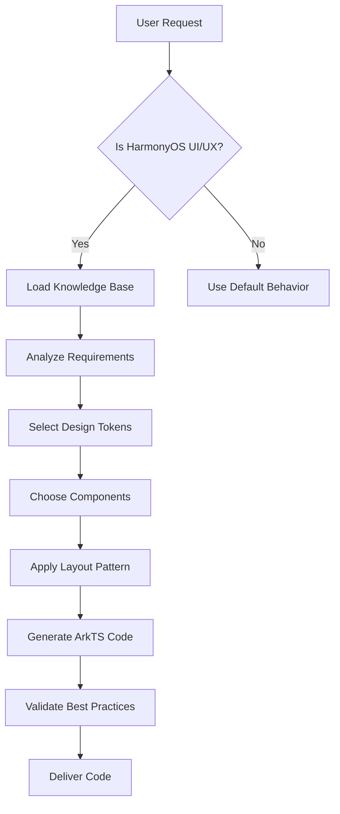

# HarmonyOS NEXT UI/UX Pro Max Skill

## Description

An AI SKILL that provides design intelligence for building professional UI/UX for **HarmonyOS NEXT** applications using **ArkUI/ArkTS**.

## Activation

This skill activates when the user requests any HarmonyOS NEXT UI/UX related work:
- Build, create, design, implement HarmonyOS NEXT UI
- Review, fix, improve HarmonyOS app interface
- 构建、创建、设计 HarmonyOS NEXT 界面
- 鸿蒙应用 UI/UX 开发
- **创建新项目** - 当用户说"创建xxx项目"时

## Usage

```
/harmony-ui-ux-pro-max Build a login page for my HarmonyOS NEXT app
/harmony-ui-ux-pro-max 创建一个商品列表页面
/harmony-ui-ux-pro-max 创建一个电商项目
```

## ⚠️ Rule 10: Project Creation (项目创建规则)

当用户请求**创建新项目**时，必须执行以下流程：

### 触发关键词
- "创建xxx项目"、"新建xxx项目"、"初始化xxx项目"
- "Create xxx project"、"Initialize xxx project"

### 执行流程

```
1. 询问用户 SDK 版本 (如果未提供)
   - 提示: "请提供 SDK 版本，格式如 6.0.2(22)，可在 DevEco Studio 项目的 build-profile.json5 中查看"

2. 确认项目信息
   - 项目名称 (从用户请求中提取)
   - SDK 版本 (用户提供)
   - 目标路径 (默认当前目录，或询问用户)

3. 调用初始化脚本
   python scripts/init_harmony_project.py <项目名> --sdk "<版本>" [--path <路径>]

4. 验证编译
   cd <项目路径>
   hvigorw assembleHap --no-daemon

5. 报告结果
   - 编译成功: 告知用户项目已创建并可用
   - 编译失败: 分析错误并修复
```

### 示例对话

```
用户: 创建一个母婴健康管理项目
AI: 好的，我来创建母婴健康管理项目。请问您的 SDK 版本是多少？
    (格式如 "6.0.2(22)"，可在 DevEco Studio 的 build-profile.json5 中查看)

用户: 6.0.2(22)
AI: 收到，正在创建项目...
    [执行] python scripts/init_harmony_project.py BabyHealth --sdk "6.0.2(22)"
    [验证] hvigorw assembleHap --no-daemon
    项目创建成功！路径: ./BabyHealth
```

### 命令参考

```bash
# 基础创建
python scripts/init_harmony_project.py <项目名> --sdk "<版本>"

# 指定路径
python scripts/init_harmony_project.py <项目名> --sdk "<版本>" --path <目录>

# 自定义包名
python scripts/init_harmony_project.py <项目名> --sdk "<版本>" --bundle <包名前缀>
```

## Skill Instructions

When this skill is activated, you MUST:

1. **Read the knowledge base** from `.shared/harmony-ui-ux-pro-max/` directory
2. **Apply HarmonyOS design principles** from the design system
3. **Use ArkUI/ArkTS syntax** for all code generation
4. **Follow the component patterns** defined in the knowledge base

## Knowledge Base Files

Load these files for design intelligence:

### 核心规范 (必读)
- `.shared/harmony-ui-ux-pro-max/CODING_RULES.md` - **⚠️ MANDATORY - 编码规则，必须首先阅读!**
- `.shared/harmony-ui-ux-pro-max/RESOURCE_SYNC_RULES.md` - **⚠️ 资源同步规则，生成代码时必读!**

### 设计系统
- `.shared/harmony-ui-ux-pro-max/DESIGN_SYSTEM.md` - Design tokens, colors, typography
- `.shared/harmony-ui-ux-pro-max/COMPONENTS.md` - Component patterns and usage
- `.shared/harmony-ui-ux-pro-max/PAGE_TEMPLATES.md` - Page structure templates

### 布局与响应式
- `.shared/harmony-ui-ux-pro-max/LAYOUTS.md` - Layout patterns for HarmonyOS
- `.shared/harmony-ui-ux-pro-max/RESPONSIVE_STRATEGY.md` - 一多架构断点和布局策略

### 性能与动画
- `.shared/harmony-ui-ux-pro-max/PERFORMANCE_GUARD.md` - 性能约束和优化规范
- `.shared/harmony-ui-ux-pro-max/ANIMATION_SYSTEM.md` - 动画曲线和转场规范

### 最佳实践
- `.shared/harmony-ui-ux-pro-max/BEST_PRACTICES.md` - UI/UX best practices

## Workflow



## Mandatory Coding Rules ⚠️

When generating code, you MUST follow these rules:

### 1. Language: ArkTS Only
- Use ArkTS (strict TypeScript-based)
- **NEVER** use `any` type - always use explicit types
- Enable strict type checking

### 2. UI Framework: ArkUI Declarative Syntax
- Use ArkUI declarative UI syntax
- Use `@Component` decorator for custom components
- Implement `build()` method in all components

### 3. State Management Priority
Use state decorators in this order:
1. `@State` - Component internal state
2. `@Prop` - One-way data binding from parent
3. `@Link` - Two-way data binding with parent
4. `@Provide` / `@Consume` - Cross-component state sharing
5. `@Observed` + `@ObjectLink` - Complex object state management

### 4. Resource References: NO Hardcoding!
- **NEVER** hardcode colors - use `$r('app.color.xxx')`
- **NEVER** hardcode strings - use `$r('app.string.xxx')`
- **NEVER** hardcode dimensions - use `$r('app.float.xxx')` or design tokens

```typescript
// CORRECT
Text($r('app.string.welcome'))
  .fontColor($r('app.color.text_primary'))
  .backgroundColor($r('app.color.bg_primary'))

// WRONG
Text('Welcome')
  .fontColor('#182431')
  .backgroundColor('#FFFFFF')
```

### 5. No Emoji in Code
- **NEVER** use emoji characters in code, comments, or string resources
- **MUST** use system symbol icons or custom icon resources instead
- Emoji causes encoding issues and is unprofessional in production code

```typescript
// CORRECT - Use icon resources
Image($r('sys.symbol.heart'))
Text($r('app.string.feeding_label'))

// WRONG - Emoji in code (FORBIDDEN!)
Text('🍼 喂养')
// 🍼 这是喂养模块
```

### 6. Icon Usage: Check Before Use
- **FIRST** check if native icon exists in `sys.symbol.*`
- **IF EXISTS** use `$r('sys.symbol.xxx')` or `SymbolGlyph`
- **IF NOT** get SVG from allsvgicons.com, save to `resources/base/media/`

### 7. Design Principles (设计规范)
- **一多架构**: 必须使用 GridCol/breakpoints/layoutWeight 实现响应式
- **视觉风格**: 高端简约，圆角 8/12/16/24vp，分层设计
- **交互动效**: 使用 animateTo + Curve.Friction/Sharp

### 8. Code Best Practices (代码质量)
- **禁止 px**: 使用 vp/fp 单位
- **build() 纯净**: 禁止在 build() 中做复杂逻辑
- **样式抽离**: 使用 AttributeModifier 复用样式
- **导航组件**: 使用 Navigation 而非 Router

### 9. Development Workflow (开发流程)
1. **分析场景** - 判断手机/折叠屏/平板的显示差异
2. **定义数据** - 先写 @State 或 Model 层
3. **构建 UI** - 使用 RelativeContainer 或 Column/Row 组合
4. **注入动效** - 添加 SharedTransition 或转场动画

### 11. Resource Integrity (资源完整性)
- **同步输出**: 生成 $r() 代码时，必须同时输出 string.json/color.json 片段
- **命名规范**: 资源 Key 遵循 `模块名_功能名_属性名` 格式

### 12. Layout Strategy (布局策略)
- **自适应**: 基础组件用 layoutWeight/百分比
- **延伸布局**: 列表/宫格用 Grid + breakpoints
- **分栏布局**: windowWidth > 600vp 时启用 SideBarContainer

### 13. Performance (性能准则)
- **减少嵌套**: 优先 RelativeContainer 替代多层 Column/Row
- **长列表**: 数据 > 50 必须用 LazyForEach + keyGenerator
- **状态隔离**: 频繁更新的状态拆分为子组件

### 14. Auto Fix (自动修复)
- 编译失败时读取错误日志自动分析修复
- 修复后重新验证编译

### 15. NEXT Features (特色功能推荐)
- **元服务**: 主动询问是否需要卡片适配
- **实况窗**: 进度类功能推荐 Live View
- **系统 Kit**: 扫码用 ScanKit，分享用 ShareKit

### 16. Cross-File Sync (跨文件同步)
- **页面注册**: 创建 @Entry 页面时必须同步更新 `main_pages.json`
- **权限声明**: 使用系统功能时必须同步更新 `module.json5` 权限配置
- **资源引用**: 新增 `$r()` 引用必须同步输出资源文件定义

### 17. No Hardcoding Enhanced (强化禁止硬编码)
- **必须提供 Diff**: 修改现有页面时，输出资源文件的增量变更（diff 格式）
- **完整输出**: 新建页面时，完整输出所有相关资源文件片段
- **命名规范**: 资源 Key 必须遵循 `模块名_功能名_属性名` 格式

### 18. Persona Enhancement (输出增强)
生成代码前后必须包含以下内容：

**代码前 - UI 架构逻辑简图**:
```
┌─────────────────────────────────────────┐
│              页面结构                    │
├─────────────────────────────────────────┤
│  ┌─────────────────────────────────┐   │
│  │           Header               │   │
│  └─────────────────────────────────┘   │
│  ┌─────────────────────────────────┐   │
│  │           Content              │   │
│  │   ┌─────┐  ┌─────┐  ┌─────┐   │   │
│  │   │Card │  │Card │  │Card │   │   │
│  │   └─────┘  └─────┘  └─────┘   │   │
│  └─────────────────────────────────┘   │
│  ┌─────────────────────────────────┐   │
│  │           Footer               │   │
│  └─────────────────────────────────┘   │
└─────────────────────────────────────────┘
```

**代码后 - 规范对齐说明**:
```
✓ Rule 1: 类型安全 - 所有变量显式类型
✓ Rule 4: 资源引用 - 无硬编码颜色/字符串
✓ Rule 7: 响应式 - 使用 GridCol + breakpoints
✓ Rule 13: 性能 - 嵌套层级 ≤ 5
✓ Rule 16: 同步 - 已更新 main_pages.json
```

### 19. Script Verification (脚本验证)
执行 Rule 10 项目创建时的完整闭环：

```
1. 检查脚本是否存在
   if not exists(scripts/init_harmony_project.py):
       提示: "初始化脚本不存在，是否需要我为您生成？"
       
2. 执行创建
   python scripts/init_harmony_project.py <项目名> --sdk "<版本>"
   
3. 验证编译
   cd <项目路径>
   hvigorw assembleHap --no-daemon
   
4. 错误处理
   if 编译失败:
       读取 .hvigor/outputs/build-logs/build.log
       分析错误类型
       自动修复配置
       重新编译验证
       
5. 成功报告
   输出项目结构概览
   提示下一步操作
```

## Core Principles

1. **HarmonyOS Design Language** - Follow HarmonyOS visual style
2. **Multi-Device Adaptation** - Support phone, tablet, watch, TV (一多架构)
3. **Theme Support** - Light/Dark mode compatibility
4. **Performance First** - Efficient rendering and smooth animations
5. **Accessibility** - Support screen readers and accessibility features
6. **Natural Motion** - 动效自然流畅，使用推荐曲线