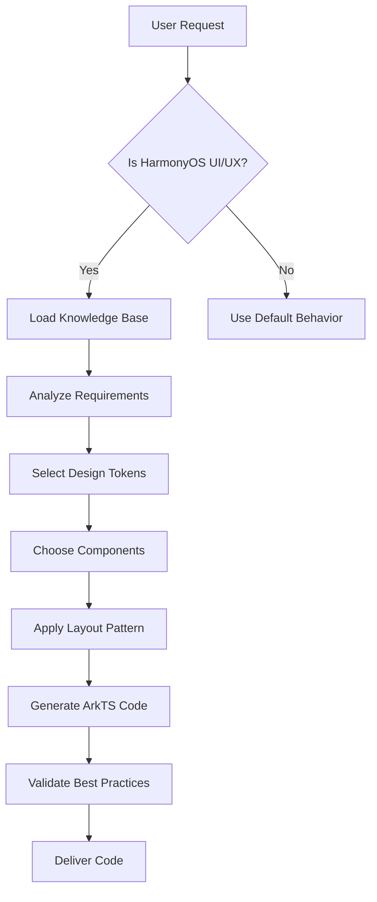

# HarmonyOS NEXT UI/UX Pro Max Skill

## Description

An AI SKILL that provides design intelligence for building professional UI/UX for **HarmonyOS NEXT** applications using **ArkUI/ArkTS**.

## Activation

This skill activates when the user requests any HarmonyOS NEXT UI/UX related work:
- Build, create, design, implement HarmonyOS NEXT UI
- Review, fix, improve HarmonyOS app interface
- 构建、创建、设计 HarmonyOS NEXT 界面
- 鸿蒙应用 UI/UX 开发

## Usage

```
/harmony-ui-ux-pro-max Build a login page for my HarmonyOS NEXT app
/harmony-ui-ux-pro-max 创建一个商品列表页面
```

## Skill Instructions

When this skill is activated, you MUST:

1. **Read the knowledge base** from `.shared/harmony-ui-ux-pro-max/` directory
2. **Apply HarmonyOS design principles** from the design system
3. **Use ArkUI/ArkTS syntax** for all code generation
4. **Follow the component patterns** defined in the knowledge base

## Knowledge Base Files

Load these files for design intelligence:

- `.shared/harmony-ui-ux-pro-max/CODING_RULES.md` - **⚠️ MANDATORY - Read first!**
- `.shared/harmony-ui-ux-pro-max/DESIGN_SYSTEM.md` - Design tokens, colors, typography
- `.shared/harmony-ui-ux-pro-max/COMPONENTS.md` - Component patterns and usage
- `.shared/harmony-ui-ux-pro-max/LAYOUTS.md` - Layout patterns for HarmonyOS
- `.shared/harmony-ui-ux-pro-max/PAGE_TEMPLATES.md` - Page structure templates
- `.shared/harmony-ui-ux-pro-max/BEST_PRACTICES.md` - UI/UX best practices

## Workflow



## Mandatory Coding Rules ⚠️

When generating code, you MUST follow these rules:

### 1. Language: ArkTS Only
- Use ArkTS (strict TypeScript-based)
- **NEVER** use `any` type - always use explicit types
- Enable strict type checking

### 2. UI Framework: ArkUI Declarative Syntax
- Use ArkUI declarative UI syntax
- Use `@Component` decorator for custom components
- Implement `build()` method in all components

### 3. State Management Priority
Use state decorators in this order:
1. `@State` - Component internal state
2. `@Prop` - One-way data binding from parent
3. `@Link` - Two-way data binding with parent
4. `@Provide` / `@Consume` - Cross-component state sharing
5. `@Observed` + `@ObjectLink` - Complex object state management

### 4. Resource References: NO Hardcoding!
- **NEVER** hardcode colors - use `$r('app.color.xxx')`
- **NEVER** hardcode strings - use `$r('app.string.xxx')`
- **NEVER** hardcode dimensions - use `$r('app.float.xxx')` or design tokens

```typescript
// ✅ CORRECT
Text($r('app.string.welcome'))
  .fontColor($r('app.color.text_primary'))
  .backgroundColor($r('app.color.bg_primary'))

// ❌ WRONG
Text('Welcome')
  .fontColor('#182431')
  .backgroundColor('#FFFFFF')
```

## Core Principles

1. **HarmonyOS Design Language** - Follow HarmonyOS visual style
2. **Multi-Device Adaptation** - Support phone, tablet, watch, TV
3. **Theme Support** - Light/Dark mode compatibility
4. **Performance First** - Efficient rendering and smooth animations
5. **Accessibility** - Support screen readers and accessibility features
